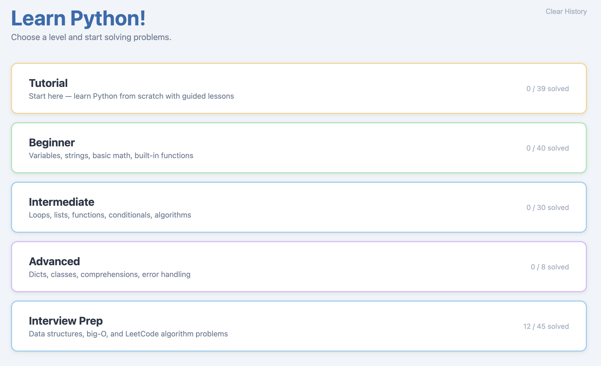
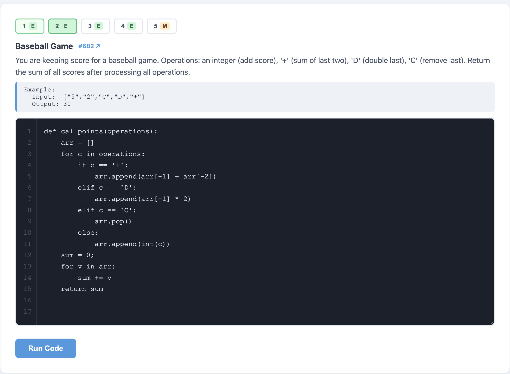

# Learn Python!

A browser-based Python learning site. Work through beginner problems, follow interactive tutorials, and practice data-structure interview questions — all with instant feedback and no installation required.





## Features

- **Three learning tracks** — classic problems (Beginner/Intermediate/Advanced), guided tutorials, and Interview Prep
- **In-browser Python** — powered by [Pyodide](https://pyodide.org) (WebAssembly); no server, no setup
- **Common stdlib pre-imported** — `Counter`, `defaultdict`, `deque`, `heapq`, and `math` are always available so students focus on problem-solving, not imports
- **Line-numbered code editor** — with Tab-to-indent and auto-indent on Enter
- **Progress tracking** — solved problems saved in `localStorage`; last submitted code per interview problem is also restored on revisit
- **Zero dependencies** — pure HTML, CSS, and JavaScript; works offline after first load

## Learning Tracks

### Classic Problems (78 total)

Output-based grading: your code's `stdout` is compared against the expected output. For concept-specific problems the grader also checks that required keywords appear in your code (e.g. `def`, `len(`, `class`).

| Level | Count | Topics |
|-------|-------|--------|
| Beginner | 40 | Printing, variables, strings, lists, arithmetic, type conversion |
| Intermediate | 30 | Loops, functions, conditionals, sorting, recursion |
| Advanced | 8 | Dictionaries, classes, list comprehensions, error handling |

### Tutorial (13 topics, 52 exercises)

Each topic has a **Learn** panel (what it is, when to use it, a worked example) followed by short free-form practice exercises graded by output.

Topics: Your First Line of Code · Numbers and Math · Variables · Booleans · Strings · Lists · Dictionaries · Functions · Loops · Conditionals · Classes · Comprehensions · Error Handling

### Interview Prep (9 topics, 45 problems)

Function-based grading: your code is called with test inputs and the return value is compared. Each problem links to its LeetCode page and shows an example input/output taken from the first test case.

| Topic | Problems (4 easy + 1 medium) |
|-------|------------------------------|
| Array | Two Sum · Best Time to Buy and Sell Stock · Contains Duplicate · Maximum Subarray · Product of Array Except Self |
| Hash Map | Valid Anagram · Ransom Note · Word Pattern · First Unique Character · Longest Consecutive Sequence |
| Stack | Valid Parentheses · Baseball Game · Remove Outermost Parentheses · Backspace String Compare · Daily Temperatures |
| Queue & Deque | Number of Students Unable to Eat Lunch · Time Needed to Buy Tickets · Remove Adjacent Duplicates · Number of Recent Calls · Sliding Window Maximum |
| Heap | Last Stone Weight · Take Gifts From the Richest Pile · K Weakest Rows · Top K Frequent Elements · Kth Largest Element |
| Linked List | Reverse Linked List · Merge Two Sorted Lists · Remove Elements · Middle of the Linked List · Remove Nth From End |
| Binary Tree | Maximum Depth · Invert Binary Tree · Symmetric Tree · Path Sum · Level Order Traversal |
| Graph | Find the Town Judge · Find if Path Exists · Island Perimeter · Max Area of Island · Number of Islands |
| Sorting & Binary Search | Binary Search · Search Insert Position · Squares of a Sorted Array · Sort Colors · Find Minimum in Rotated Sorted Array |

**Test result display:** after running, shows `(x/y) tests passed` and, on failure, the first failing input with labeled parameter names (e.g. `nums = [3,2,4], target = 6`) plus the expected and actual values. Each problem has 8–10 test cases covering edge cases (empty input, negatives, duplicates, boundary values).

## Running Locally

No build step needed. Use the included server script:

```bash
python3 server.py 8080
```

Then open [http://localhost:8080](http://localhost:8080).

The script sets the `Cross-Origin-Opener-Policy` and `Cross-Origin-Embedder-Policy` headers required by Pyodide. Plain `python3 -m http.server` will not work because those headers are missing.

## How It Works

- Python runs entirely in the browser via **Pyodide** (WebAssembly)
- On load, common stdlib names are pre-imported into the Pyodide global namespace so they are always available regardless of problem order
- **Classic / Tutorial grading:** `stdout` is captured into a `StringIO` buffer and compared against `expectedOutput`
- **Interview grading:** user code is executed to define the function, then a test runner calls it with each test case's `args` and compares the return value to `expected`; linked-list and tree arguments are automatically converted to/from `ListNode`/`TreeNode` objects
- Progress is stored in `localStorage` under the key `pylearn_solved`; last-submitted interview code is stored under `pylearn_interview_code`

## Project Structure

```
index.html   — app shell; five views (level select, problems, editor, tutorial, interview)
app.js       — view routing, Pyodide loading, code execution, grading, editor behaviour
data.js      — all content: PROBLEMS (classic), TUTORIAL, INTERVIEW
style.css    — styles
server.py    — minimal static file server with required COOP/COEP headers
```

## License

MIT
