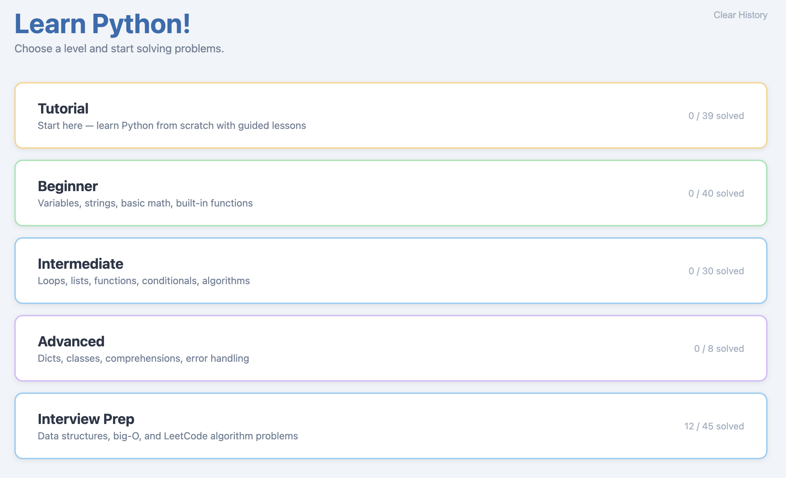
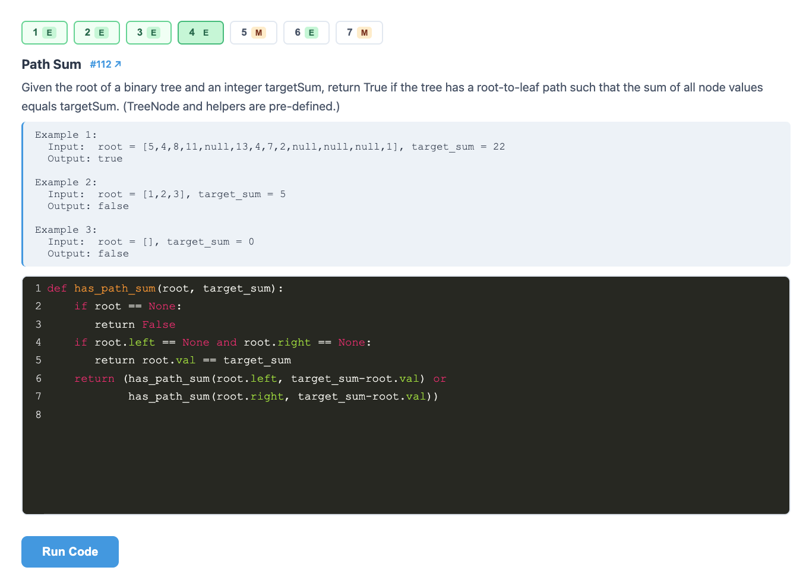

# Python Self-Learning: From Zero to Interview-Ready

[](https://python-learning-course.pages.dev)


A browser-based Python learning site. Work through beginner problems, follow interactive tutorials, and practice data-structure interview questions — all with instant feedback and no installation required.

## Who is this for?

| Section | Problems | Who it's for |
|---------|----------|--------------|
| **Tutorial** | 52 exercises | Complete beginners — never written a line of code |
| **Beginner** | 40 problems | Just starting out — learning syntax and basic concepts |
| **Intermediate** | 30 problems | Getting comfortable — loops, functions, and algorithms |
| **Advanced** | 8 problems | Solid foundation — OOP, comprehensions, error handling |
| **Interview Prep** | 53 problems | Job seekers — LeetCode-style data structure problems |





## Features

- **Three learning tracks** — classic problems (Beginner/Intermediate/Advanced), guided tutorials, and Interview Prep
- **In-browser Python** — powered by [Pyodide](https://pyodide.org) (WebAssembly); no server, no setup
- **Common stdlib pre-imported** — `Counter`, `defaultdict`, `deque`, `heapq`, and `math` are always available so students focus on problem-solving, not imports
- **Line-numbered code editor** — with Tab-to-indent and auto-indent on Enter
- **Progress tracking** — solved problems saved in `localStorage`; last submitted code per interview problem is also restored on revisit
- **Zero dependencies** — pure HTML, CSS, and JavaScript; works offline after first load

## Learning Tracks

### Classic Problems (78 total)

Output-based grading: your code's `stdout` is compared against the expected output. For concept-specific problems the grader also checks that required keywords appear in your code (e.g. `def`, `len(`, `class`).

| Level | Count | Topics |
|-------|-------|--------|
| Beginner | 40 | Printing, variables, strings, lists, arithmetic, type conversion |
| Intermediate | 30 | Loops, functions, conditionals, sorting, recursion |
| Advanced | 8 | Dictionaries, classes, list comprehensions, error handling |

### Tutorial (13 topics, 52 exercises)

Each topic has a **Learn** panel (what it is, when to use it, a worked example) followed by short free-form practice exercises graded by output.

Topics: Your First Line of Code · Numbers and Math · Variables · Booleans · Strings · Lists · Dictionaries · Functions · Loops · Conditionals · Classes · Comprehensions · Error Handling

### Interview Prep — Classic Data Structures (9 topics, 53 problems)

Function-based grading: your code is called with test inputs and the return value is compared. Each problem links to its LeetCode page and shows 2–3 labeled examples. After running, shows `(x/y) tests passed` and, on failure, the first failing input with labeled parameter names. Each problem has 8–10 test cases covering edge cases.

| Topic | Problem | LC# | Difficulty | Pattern |
|-------|---------|-----|------------|---------|
| **Array** | Two Sum | 1 | Easy | Hash map for complement lookup |
| | Best Time to Buy and Sell Stock | 121 | Easy | Running minimum + max profit |
| | Contains Duplicate | 217 | Easy | Hash set membership |
| | Maximum Subarray | 53 | Easy | Kadane's algorithm |
| | Product of Array Except Self | 238 | Medium | Prefix / suffix products |
| **Hash Map** | Valid Anagram | 242 | Easy | Character frequency count |
| | Ransom Note | 383 | Easy | Frequency subset check |
| | Word Pattern | 290 | Easy | Bijection mapping |
| | First Unique Character | 387 | Easy | Ordered frequency count |
| | Longest Consecutive Sequence | 128 | Medium | Hash set + sequence-start detection |
| **Stack** | Valid Parentheses | 20 | Easy | Matching brackets with stack |
| | Baseball Game | 682 | Easy | Stack simulation |
| | Remove Outermost Parentheses | 1021 | Easy | Depth tracking with stack |
| | Backspace String Compare | 844 | Easy | Stack to process deletions |
| | Daily Temperatures | 739 | Medium | Monotonic stack |
| **Queue & Deque** | Number of Students Unable to Eat Lunch | 1700 | Easy | Queue simulation |
| | Implement Queue using Stacks | 232 | Easy | Two-stack queue design |
| | Implement Stack using Queues | 225 | Easy | Queue-based stack design |
| | Number of Recent Calls | 933 | Easy | Sliding window with deque |
| | Design Circular Queue | 622 | Medium | Circular buffer design |
| **Heap** | Last Stone Weight | 1046 | Easy | Max-heap simulation (negate) |
| | Kth Largest Element in a Stream | 703 | Easy | Min-heap of size k |
| | K Weakest Rows in a Matrix | 1337 | Easy | Heap with tuple keys |
| | Top K Frequent Elements | 347 | Medium | Heap + frequency count |
| | Kth Largest Element in an Array | 215 | Medium | Min-heap of size k / quickselect |
| **Linked List** | Reverse Linked List | 206 | Easy | In-place pointer reversal |
| | Merge Two Sorted Lists | 21 | Easy | Merge with dummy head |
| | Remove Linked List Elements | 203 | Easy | Dummy head traversal |
| | Middle of the Linked List | 876 | Easy | Slow / fast pointer |
| | Remove Nth Node From End | 19 | Medium | Two-pointer gap of n |
| **Binary Tree** | Maximum Depth of Binary Tree | 104 | Easy | DFS recursion |
| | Invert Binary Tree | 226 | Easy | Recursive left/right swap |
| | Symmetric Tree | 101 | Easy | Mirror comparison DFS |
| | Path Sum | 112 | Easy | DFS with running sum |
| | Lowest Common Ancestor of BST | 235 | Easy | BST property navigation |
| | Binary Tree Level Order Traversal | 102 | Medium | BFS level-by-level |
| | Validate Binary Search Tree | 98 | Medium | DFS with min/max bounds |
| **Graph** | Flood Fill | 733 | Easy | Grid DFS |
| | Max Area of Island | 695 | Easy | Grid DFS + area counting |
| | Number of Provinces | 547 | Medium | Connected components DFS |
| | Number of Islands | 200 | Medium | Classic grid graph DFS/BFS |
| | Rotting Oranges | 994 | Medium | Multi-source BFS |
| | Course Schedule | 207 | Medium | Cycle detection (topological sort) |
| | Course Schedule II | 210 | Medium | Topological sort ordering |
| **Sorting & Binary Search** | Binary Search | 704 | Easy | Classic lo/hi template |
| | Search Insert Position | 35 | Easy | Lower-bound binary search |
| | First Bad Version | 278 | Easy | Binary search on answer |
| | Sort Colors | 75 | Easy | Dutch National Flag (3-way partition) |
| | Find Minimum in Rotated Sorted Array | 153 | Medium | Rotated array binary search |
| | Search in Rotated Sorted Array | 33 | Medium | Rotated array + target |
| | Find First and Last Position of Element | 34 | Medium | Left / right boundary search |
| | Merge Intervals | 56 | Medium | Sort by start + sweep to merge |
| | Search a 2D Matrix | 74 | Medium | Flatten 2D to 1D binary search |

## Running Locally

No build step needed. Use the included server script:

```bash
python3 server.py 8080
```

Then open [http://localhost:8080](http://localhost:8080).

The script sets the `Cross-Origin-Opener-Policy` and `Cross-Origin-Embedder-Policy` headers required by Pyodide. Plain `python3 -m http.server` will not work because those headers are missing.

## How It Works

- Python runs entirely in the browser via **Pyodide** (WebAssembly)
- On load, common stdlib names are pre-imported into the Pyodide global namespace so they are always available regardless of problem order
- **Classic / Tutorial grading:** `stdout` is captured into a `StringIO` buffer and compared against `expectedOutput`
- **Interview grading:** user code is executed to define the function, then a test runner calls it with each test case's `args` and compares the return value to `expected`; linked-list and tree arguments are automatically converted to/from `ListNode`/`TreeNode` objects
- Progress is stored in `localStorage` under the key `pylearn_solved`; last-submitted interview code is stored under `pylearn_interview_code`

## Project Structure

```
index.html   — app shell; five views (level select, problems, editor, tutorial, interview)
app.js       — view routing, Pyodide loading, code execution, grading, editor behaviour
data.js      — all content: PROBLEMS (classic), TUTORIAL, INTERVIEW
style.css    — styles
server.py    — minimal static file server with required COOP/COEP headers
```

## License

MIT
